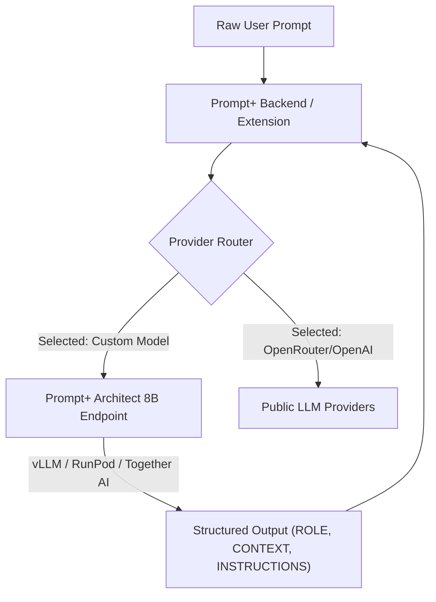

Backend Fixes & Improvements Plan

🔴 Critical (Security & Correctness)(done)
#	Issue	Location	Impact
1	Missing NEXTAUTH_SECRET / AUTH_SECRET in production	vercel env	Auth tokens unsigned → session hijacking possible
2	No AUTH_TRUST_HOST or NEXTAUTH_URL set	Vercel env / lib/auth/config.ts	NextAuth v5 may reject valid callbacks in production
3	In-memory rate limit bucket resets on deploy	lib/rate-limit.ts	Users bypass daily limit after each deploy; not scalable
4	Hardcoded fallback ENCRYPTION_KEY	lib/crypto.ts:6	If ENCRYPTION_KEY not set in prod, all encrypted API keys decrypt with same weak default
5	OAuth providers registered without env checks	lib/auth/config.ts:12-19	NextAuth initializes GitHub/Google providers with undefined → crashes or /api/auth/error on callback
6	No CSRF protection on state-changing API routes	All POST/PUT/DELETE in app/api/v1/*	Vulnerable to CSRF via browser cookies
7	Middleware only checks auth, not permissions	middleware.ts	No authorization layer; any authenticated user can access all /api/v1 routes

🟠 High (Reliability & Architecture)(done)
#	Issue	Location	Impact
8	Prisma 7 driver adapter requires @prisma/adapter-neon	lib/db/prisma.ts	Works now but not idiomatic; connection pooling not configured
9	getDb() singleton not properly scoped for serverless	lib/db/prisma.ts	Cold starts may leak connections; no await prisma.$connect()
10	No request validation middleware	All routes duplicate request.json() + safeParse	Boilerplate, inconsistent error format, easy to forget
11	Duplicate auth check in every route	All app/api/v1/*/route.ts	Violates DRY; easy to forget auth() call
12	No structured logging / error tracking	Throughout	Hard to debug production issues
13	LLM provider errors not differentiated	lib/llm/providers.ts	All failures fall back silently; no alerting on quota/key errors
14	Rate limit uses global Map (not shared across instances)	lib/rate-limit.ts	Won't work in multi-instance Vercel/container deployments
15	Missing DELETE endpoints for collections, prompts, templates	app/api/v1/*	No way to clean up user data (GDPR compliance gap)

🟡 Medium (Developer Experience & Maintainability)(done)
#	Issue	Location
16	Inconsistent response shape	Routes return { data }, { error }, { data, total, page }, { data: { ... } }
17	No OpenAPI / Swagger spec	Missing
18	Zod schemas defined inline or split across files	lib/validations/*
19	No integration tests for API routes	__tests__/ only unit tests
20	bcrypt with cost 12 in signup but default in authorize	lib/auth/config.ts vs app/api/auth/signup/route.ts
21	No health check / readiness endpoint	Missing
22	No API versioning strategy in URL	/api/v1/ hardcoded
23	Prompt score stored as untyped JSON	schema.prisma:82
24	Template variables field always empty array	templates/route.ts:73
25	No pagination cursor support	All list endpoints use offset/limit

🟢 Low (Nice-to-Have / Polish) (done)
#	Improvement	Area
26	Add request ID header for tracing	Middleware
27	Implement API key rotation / expiry reminders	api-keys
28	Add webhook support for async LLM jobs	enhance-ai, analyze, score
29	Cache template list with next/cache	templates/route.ts
30	Add lastLoginAt update on credential sign-in	lib/auth/config.ts:47-52 (already done!)
31	Extract common auth() + getDb() into HOC/wrapper	All routes
32	Add X-RateLimit-* headers to all rate-limited endpoints	rate-limit.ts
33	Soft-delete instead of hard delete for user data	Prisma models + routes
Suggested Execution Order
1. Phase 1 (Security): #1-7 — deploy-blocking
2. Phase 2 (Architecture): #8-15 — refactor auth, rate-limit, validation, logging
3. Phase 3 (API Consistency): #16-22 — unify response format, add OpenAPI, versioning
4. Phase 4 (Features): #23-25, #27-33 — complete missing CRUD, improve schemas, add observability

To transform Prompt+ from a standalone web dashboard into an ecosystem like Promptive Architect, here are the top recommended improvements, ordered by impact:

1. 🧩 Build a Companion Browser Extension (Chrome / Firefox / Edge)
Goal: Allow users to access Prompt+ features without switching tabs away from ChatGPT, Claude, or Gemini.
Key Capabilities to Implement:
Quick Prompt Picker: Open a lightweight extension popup (Alt + P) to search, copy, or insert saved Prompt+ templates.
In-Situ Enhancer: Add an "✨ Enhance with Prompt+" button directly inside ChatGPT and Claude input fields.
Auto Sync: Syncs with your existing /api/v1/prompts and /api/v1/templates REST API endpoints using user auth tokens.
2. 🧠 Implement "Context Memory" & System Rules Engine
Goal: Stop users from repeating project context (e.g. "We use Next.js App Router, Tailwind CSS, TypeScript, and Prisma").
Key Capabilities to Implement:
Project Context Blocks: Allow users to save reusable "Context Blocks" (e.g., Frontend Tech Stack, Tone Guidelines, API Specs).
One-Click Context Injection: When enhancing or running a prompt, let users select active Context Blocks to automatically prepended to the system prompt.
3. ⏱️ Real-Time Token & Cost Estimation
Goal: Show users exact token count and cost predictions before they send prompts.
Key Capabilities to Implement:
Pre-Execution Counter: Display token count (tiktoken / js-tiktoken) and estimated cost ($) as the user types.
Model Comparison Cost Breakdown: Show side-by-side cost difference between gpt-4o, gpt-4o-mini, and claude-3-5-sonnet.
4. 💻 Create an IDE Plugin or Raycast Extension
Goal: Target developers directly in VS Code / Cursor / Windsurf.
Key Capabilities to Implement:
Auto-Include Code Context: Allow selecting code snippets in VS Code and pressing Cmd+Shift+P -> Enhance Prompt with Prompt+.
Command-Line Interface (CLI): Simple prompt+ enhance "my prompt" CLI tool for terminal workflows.
5. 🤝 Public Template Marketplace & Community Sharing
Goal: Leverage Prompt+'s superior library feature to build a community hub.
Key Capabilities to Implement:
Public Template Gallery: Allow users to publish high-scoring prompts to a public showcase.
Fork & Clone: 1-click "Fork Template" into personal user collections.

🎯 Recommended Next Step
If you want to start building one of these enhancements, Building the Companion Chrome Extension (or adding Context Memory Blocks) will yield the biggest immediate boost to user experience! Let me know which one you'd like to tackle first.

# Implementation Plan - Custom Prompt+ AI Model (Fine-Tuning, Hosting & Integration)

Build, fine-tune, host, and seamlessly integrate a custom domain-specific model (**Prompt+ Architect 8B**) tailored specifically for prompt optimization. This plan covers the entire pipeline: **dataset curation, QLoRA fine-tuning, cloud serverless & local hosting, and Next.js backend integration**.

---

## 🎯 Architecture Overview

---

## 🚀 Phase 1: Model Fine-Tuning & Dataset Curation

1. **Base Model Selection**: `Llama-3.1-8B-Instruct` or `Qwen-2.5-7B-Instruct` (ultra-fast, highly accurate at structural adherence).
2. **Dataset Curation**:
   - Create a synthetic training dataset of 2,500+ high-quality pairs `(input_prompt, optimized_prompt)` formatted with `ROLE`, `CONTEXT`, `INSTRUCTIONS`, and `CONSTRAINTS`.
   - Format: Standard ChatML / Llama-3 instruction template.
3. **Training Stack**:
   - Use **Unsloth QLoRA** (reduces VRAM requirements by 60%, trains in ~30 minutes on an RTX 4090 / Colab GPU).
   - Save weights as GGUF (for local Ollama deployment) and Safetensors (for cloud vLLM deployment).

---

## ☁️ Phase 2: Model Hosting & Serving Strategy

1. **Serverless Cloud Hosting (Production)**:
   - Deploy fine-tuned model weights to **Together AI (Custom Model Endpoint)** or **RunPod Serverless / Replicate** running vLLM.
   - Exposes a standard, ultra-fast OpenAI-compatible endpoint: `https://api.together.xyz/v1/chat/completions` or `https://<pod-id>.runpod.net/v1/chat/completions`.
2. **Self-Hosted / Local Fallback**:
   - Ollama / vLLM Docker container support (`http://localhost:11434/v1`).

---

## ⚙️ Phase 3: Backend Integration & Routing

### 1. Provider Layer ([providers.ts](file:///Users/omkar/prompt-plus/src/lib/llm/providers.ts))
- Add `"custom"` to `LLMRequestOptions.provider`.
- Configure `CUSTOM_LLM_API_URL` and `CUSTOM_LLM_API_KEY` in environment variables (`.env.local` / Vercel).
- Pass request to custom serverless vLLM or Together AI endpoint.

### 2. API Routes ([enhance-ai/route.ts](file:///Users/omkar/prompt-plus/src/app/api/v1/prompts/enhance-ai/route.ts))
- Add `promptplus-architect-8b` to allowed models.
- Automatic routing to the fine-tuned custom endpoint when selected.

---

## 🖥️ Phase 4: UI & Extension Integration

### 1. Dashboard Settings ([settings/page.tsx](file:///Users/omkar/prompt-plus/src/app/(dashboard)/dashboard/settings/page.tsx))
- Add a **Custom LLM Endpoint** section where admins/users can input custom model API URLs (e.g. RunPod, Together AI, or local Ollama).

### 2. Browser Extension ([popup.html](file:///Users/omkar/prompt-plus/extension/popup.html) & [content.js](file:///Users/omkar/prompt-plus/extension/content.js))
- Add **Prompt+ Architect 8B (Fine-Tuned)** to model dropdowns as the recommended primary model.

---

## 🛠️ Proposed Changes

### [MODIFY] [providers.ts](file:///Users/omkar/prompt-plus/src/lib/llm/providers.ts)
- Add `custom` provider routing logic and `CUSTOM_LLM_API_URL` environment variable support.

### [MODIFY] [enhance-ai/route.ts](file:///Users/omkar/prompt-plus/src/app/api/v1/prompts/enhance-ai/route.ts)
- Add fallback check for `CUSTOM_LLM_API_KEY` and `CUSTOM_LLM_API_URL`.

### [MODIFY] [popup.html](file:///Users/omkar/prompt-plus/extension/popup.html)
- Add `promptplus-architect-8b::custom` option in model selection dropdown.

### [NEW] [scripts/fine_tune_unsloth.py](file:///Users/omkar/prompt-plus/scripts/fine_tune_unsloth.py)
- Python script providing the exact Unsloth training pipeline to fine-tune Llama 3.1 8B on prompt engineering pairs.

---

## 🧪 Verification Plan

### Automated Verification
- Run `npm run build` to confirm TypeScript compilation.
- Test custom endpoint routing via unit test hitting a mock OpenAI-compatible endpoint.

### Manual Verification
- Test selecting "Prompt+ Architect 8B" in Dashboard and Browser Extension.
- Verify request latency and response format correctness.
