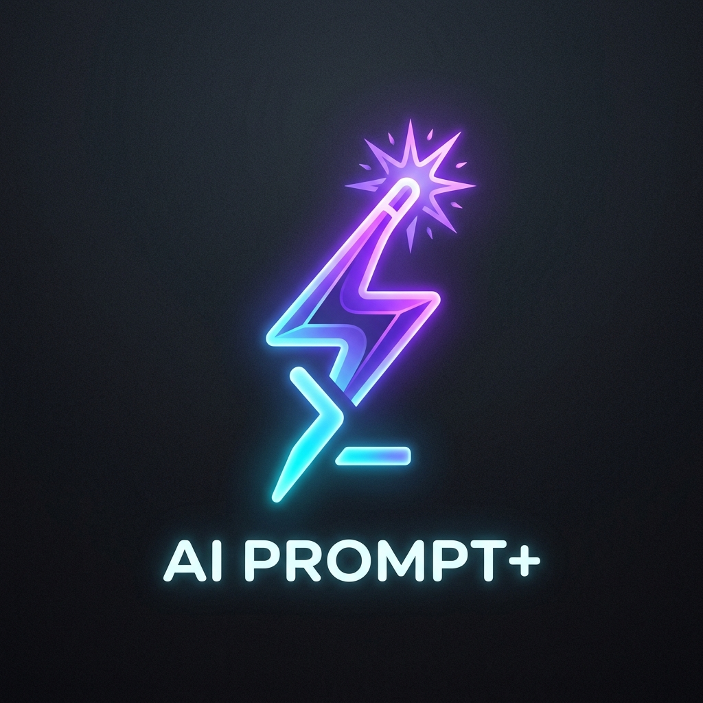

<div align="center">
  <a href="https://prompt-plus-three.vercel.app">
    
  </a>
  <br>
  <a href="https://prompt-plus-three.vercel.app">
    
  </a>
  <br>
  
</div>

<br>

<p align="center">
  <a href="https://prompt-plus-three.vercel.app">
    
  </a>
  <a href="#extension">
    
  </a>
  <a href="LICENSE">
    
  </a>
  <a href="https://github.com/OK45batwal/Prompt-plus">
    
  </a>
</p>

<p align="center">
  <a href="#features">Features</a> <kbd>·</kbd>
  <a href="#pipeline">Pipeline</a> <kbd>·</kbd>
  <a href="#screenshots">Screenshots</a> <kbd>·</kbd>
  <a href="#tech">Tech Stack</a> <kbd>·</kbd>
  <a href="#quickstart">Quickstart</a> <kbd>·</kbd>
  <a href="#extension">Extension</a>
</p>

<br>

<!-- HERO SHOWCASE -->
<div align="center">
  <table>
    <tr>
      <td align="center"><b>☀️ Light Dashboard</b></td>
      <td align="center"><b>🌙 Dark Dashboard</b></td>
    </tr>
    <tr>
      <td></td>
      <td></td>
    </tr>
  </table>
  <br>
  <table>
    <tr>
      <td align="center"><b>⚡ Prompt Builder</b></td>
      <td align="center"><b>📚 Library</b></td>
      <td align="center"><b>📁 Collections</b></td>
    </tr>
    <tr>
      <td></td>
      <td></td>
      <td></td>
    </tr>
  </table>
  <p><em>Prompt+ Dashboard — analytics, prompt builder, library, and collections</em></p>
</div>

<br>

---

<h2 id="features">✨ Features</h2>

<table>
  <tr>
    <td width="33%" align="center">
      <br>
      <code>🧠</code>
      <h3>8‑Step Pipeline</h3>
      <p>Intent analysis → gap detection → meta-prompt compilation → AI rewrite → quality validation. Not just reworded — architecturally restructured.</p>
    </td>
    <td width="33%" align="center">
      <br>
      <code>🔌</code>
      <h3>Chrome Extension</h3>
      <p>Floating FAB on ChatGPT, Claude & Gemini. Glass‑morphism side panel with analysis, model selection, and one‑click replace.</p>
    </td>
    <td width="33%" align="center">
      <br>
      <code>🦙</code>
      <h3>7 Free Models</h3>
      <p>Llama 3.3 70B · Gemini 2.0 Flash · DeepSeek R1 · Qwen 2.5 Coder · Mistral Small · Phi-3 Mini · Hermes 3 405B — all via OpenRouter.</p>
    </td>
  </tr>
  <tr>
    <td width="33%" align="center">
      <br>
      <code>🖥️</code>
      <h3>NVIDIA Free Tier</h3>
      <p>Llama 3.3 70B · Nemotron 70B · Gemma 2 27B · Mistral 7B — via the NVIDIA API. Add your key in Settings and use from any page or extension.</p>
    </td>
    <td width="33%" align="center">
      <br>
      <code>📊</code>
      <h3>Analytics</h3>
      <p>Daily/monthly usage with progress bars. Average scores, total enhancements, trends — all real‑time.</p>
    </td>
    <td width="33%" align="center">
      <br>
      <code>🔐</code>
      <h3>Encrypted Keys</h3>
      <p>Per‑provider key management with AES‑256‑GCM encryption. OpenAI · Anthropic · OpenRouter · Google · NVIDIA.</p>
    </td>
  </tr>
  <tr>
    <td width="33%" align="center">
      <br>
      <code>📚</code>
      <h3>Library & Collections</h3>
      <p>Save prompts. Organize into collections. Search, filter, favorite, and reuse with one click.</p>
    </td>
    <td width="33%" align="center">
      <br>
      <code>🎯</code>
      <h3>6‑Dimension Scoring</h3>
      <p>Real‑time evaluation: Clarity · Specificity · Structure · Context · Constraints · Actionability. Score ring in the extension panel.</p>
    </td>
    <td width="33%" align="center">
      <br>
      <code>🌓</code>
      <h3>Dark / Light Theme</h3>
      <p>System‑aware with manual override. High‑contrast in both modes.</p>
    </td>
  </tr>
</table>

---

<h2 id="pipeline">⚡ Pipeline</h2>

<div align="center">

```
Input ──→ Intent Analysis ──→ Gap Detection ──→ Meta-Prompt Compilation
                                                  │
              ┌────────────────────────────────────┘
              ▼
        Provider Dispatch ──→ Architectural Rewrite ──→ Quality Audit ──→ Delivery
        (OpenRouter · NVIDIA · OpenAI · Anthropic)       (6‑metric)       (Copy/Replace/Save)
```

</div>

| # | Stage | Description |
|---|-------|-------------|
| 1 | **Input Acquisition** | Raw prompt from dashboard or extension FAB |
| 2 | **Intent Analysis** | Classifies domain, task type, complexity level |
| 3 | **Gap Detection** | Finds missing role, context, constraints, audience, tone, examples, format |
| 4 | **Meta-Prompt Compilation** | Builds hidden instructions that guide the AI while preserving user intent |
| 5 | **Provider Dispatch** | Routes to selected model: OpenRouter (free), NVIDIA, OpenAI, or Anthropic |
| 6 | **Architectural Rewrite** | AI restructures with Role, Instructions, Constraints, Variables |
| 7 | **Quality Validation** | 6‑metric audit: completeness, boundaries, actionability, structure |
| 8 | **Delivery** | Enhanced prompt with Copy · Edit · Save · Insert into chat |

---

<h2 id="tech">🛠️ Tech Stack</h2>

<div align="center">

| Layer | Technology |
|-------|------------|
| **Framework** | Next.js 16 (App Router) |
| **Language** | TypeScript 5 (Strict Mode) |
| **Styling** | Tailwind CSS v4 + shadcn/ui + Lucide Icons |
| **Authentication** | NextAuth.js v5 (JWT · Bcrypt · Google · GitHub) |
| **Database** | PostgreSQL + Prisma ORM |
| **AI Providers** | OpenRouter · NVIDIA · OpenAI · Anthropic |
| **Extension** | Manifest V3 Chrome Extension |
| **Testing** | Vitest |
| **Security** | AES-256-GCM · Rate Limiting · CSRF · Request ID Tracing |

<br>

<p>
  
  
  
  
  
  
</p>

</div>

---

<h2 id="screenshots">🖼️ Gallery</h2>

<div align="center">

<table>
  <tr>
    <td align="center"><b>⚡ Prompt Builder</b></td>
    <td align="center"><b>📚 Prompt Library</b></td>
  </tr>
  <tr>
    <td></td>
    <td></td>
  </tr>
  <tr>
    <td align="center"><b>📁 Collections</b></td>
    <td align="center"><b>📱 Mobile</b></td>
  </tr>
  <tr>
    <td></td>
    <td></td>
  </tr>
</table>

</div>

---

<h2 id="quickstart">🚀 Quickstart</h2>

<details>
<summary><b>🐳 Local Development</b></summary>

```bash
# Clone & install
git clone https://github.com/OK45batwal/Prompt-plus.git
cd Prompt-plus
npm install

# Configure environment
cp .env.example .env
# Edit DATABASE_URL and API keys in .env

# Database
npx prisma migrate dev

# Start
npm run dev
```

Open [http://localhost:3000](http://localhost:3000).

</details>

<details>
<summary><b>🧪 Run Tests</b></summary>

```bash
npm test
```

</details>

<details>
<summary><b>🔑 Environment Variables</b></summary>

| Variable | Required | Description |
|----------|----------|-------------|
| `DATABASE_URL` | ✅ | PostgreSQL connection string |
| `NEXTAUTH_SECRET` | ✅ | JWT secret (min 32 chars) |
| `GOOGLE_CLIENT_ID` | — | Google OAuth |
| `GOOGLE_CLIENT_SECRET` | — | Google OAuth |
| `GITHUB_CLIENT_ID` | — | GitHub OAuth |
| `GITHUB_CLIENT_SECRET` | — | GitHub OAuth |
| `OPENAI_API_KEY` | — | Fallback AI key |
| `OPENROUTER_API_KEY` | — | Fallback AI key |
| `ANTHROPIC_API_KEY` | — | Fallback AI key |
| `RESEND_API_KEY` | — | Password reset emails |
| `ENCRYPTION_KEY` | — | AES-256 key for API key storage |

</details>

---

<h2 id="extension">🔌 Chrome Extension</h2>

<p align="center">
  
  
  
</p>

Inject Prompt+ directly into **ChatGPT**, **Claude**, and **Gemini** with a floating sparkle button.

<details>
<summary><b>📋 Features</b></summary>

<br>

| Component | Details |
|-----------|---------|
| **FAB** | 36px purple gradient button near every input field |
| **Side Panel** | 420px glass‑morphism panel with analysis, suggestions, model selector, preview, history, settings |
| **Analysis** | Score ring · Intent · Complexity · Word count |
| **Suggestions** | Role · Constraints · Format · Context · Examples |
| **Models** | 11 models across OpenRouter (7 free) + NVIDIA (4) + paid |
| **Popup** | Quick enhance + model selector + API key management |

</details>

<details>
<summary><b>📦 Install</b></summary>

```bash
1. Open chrome://extensions
2. Enable Developer mode
3. Click "Load unpacked"
4. Select the extension/ folder
5. Visit chatgpt.com, claude.ai, or gemini.google.com
```

</details>

---

<h2 id="stats">📊 Activity</h2>

<p align="center">
  
  
  
  
</p>

<br>

<p align="center">
  
  <br>
  
</p>

---

<p align="center">
  <sub>Built with TypeScript, Next.js, and ❤️</sub>
  <br>
  <a href="LICENSE">MIT License</a>
</p>
