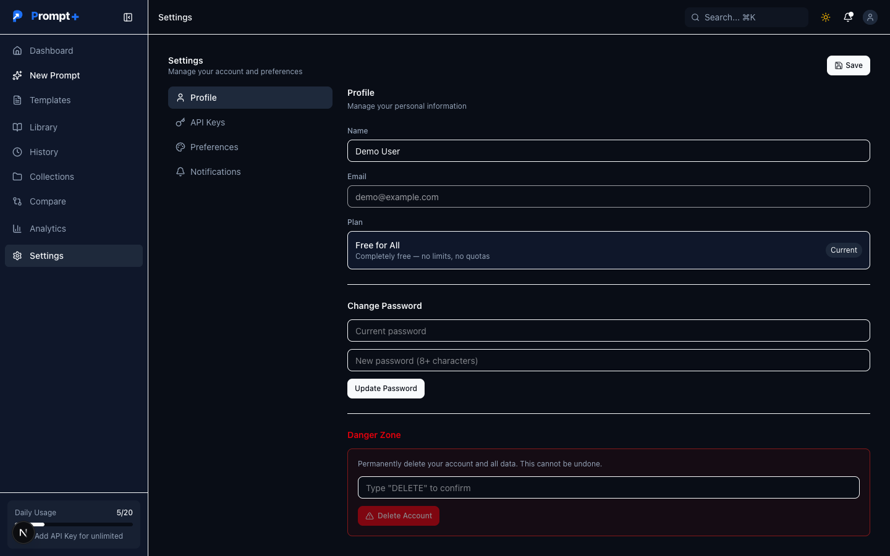

<div align="center">

  

  <h1>Prompt+</h1>
  <p>
    <strong>Enterprise-grade AI prompt engineering.</strong> Rewrite rough ideas into role-conditioned, constraint-rich
    instructions built for <strong>ChatGPT · Claude · Gemini · DeepSeek</strong> — with a private, offline
    <strong>On-Device Gemini Nano</strong> mode and a native browser extension.
  </p>

  <br>

  <p>
    <a href="https://prompt-plus-three.vercel.app/">
      
    </a>
    <a href="https://chromewebstore.google.com/detail/gdfaohfmmjjmpiggdcankjjihpljoccn">
      
    </a>
    <a href="https://github.com/OK45batwal/Prompt-plus">
      
    </a>
    <a href="https://github.com/OK45batwal/Prompt-plus/actions">
      
    </a>
    <a href="LICENSE">
      
    </a>
  </p>

  <!-- Nav -->
  <p>
    <a href="#features"><strong>Features</strong></a> ·
    <a href="#visual-tour"><strong>Visual Tour</strong></a> ·
    <a href="#compiler"><strong>Compiler</strong></a> ·
    <a href="#browser-extension"><strong>Extension</strong></a> ·
    <a href="#tech-stack"><strong>Tech Stack</strong></a> ·
    <a href="#api-reference"><strong>API Reference</strong></a> ·
    <a href="#quickstart"><strong>Quickstart</strong></a>
  </p>

</div>

---

## Features

<div align="center">

<table width="100%">
  <tr>
    <td width="33%" valign="top">
      <p align="center"><strong>⚡ 8-Step Compiler</strong></p>
      <p align="center" style="font-size:13px;color:#94a3b8">Intent analysis, context-gap detection, role conditioning and boundary constraints — prompts are <em>compiled</em>, not reworded.</p>
    </td>
    <td width="33%" valign="top">
      <p align="center"><strong>📱 On-Device Gemini Nano</strong></p>
      <p align="center" style="font-size:13px;color:#94a3b8">Runs 100% locally in Chrome 138+ via the Prompt API. Fully private, zero cost, offline, no API key required.</p>
    </td>
    <td width="34%" valign="top">
      <p align="center"><strong>🛰️ Free-Tier AI Routing</strong></p>
      <p align="center" style="font-size:13px;color:#94a3b8">Out-of-the-box routing to OpenRouter Free and NVIDIA NIM free models — bring your own key or stay on the free server tier.</p>
    </td>
  </tr>
  <tr>
    <td valign="top">
      <p align="center"><strong>📊 6-Metric Quality Audit</strong></p>
      <p align="center" style="font-size:13px;color:#94a3b8">Clarity, Specificity, Structure, Context, Constraints, Actionability — scored with a 100-point quality index.</p>
    </td>
    <td valign="top">
      <p align="center"><strong>📚 Curated Library</strong></p>
      <p align="center" style="font-size:13px;color:#94a3b8">Hand-crafted prompt blueprints with 1-click copy, collections, version history and templates.</p>
    </td>
    <td valign="top">
      <p align="center"><strong>🔐 AES-256 Key Vault</strong></p>
      <p align="center" style="font-size:13px;color:#94a3b8">Per-provider API keys encrypted with AES-256-GCM. Optional — free models cover you by default.</p>
    </td>
  </tr>
</table>
</div>

---

## Visual Tour

<div align="center">
  <table>
    <tr>
      <td width="50%">
        
        <p align="center"><sub><strong>Landing page & hero</strong></sub></p>
      </td>
      <td width="50%">
        
        <p align="center"><sub><strong>Dashboard command center & quick stats</strong></sub></p>
      </td>
    </tr>
    <tr>
      <td width="50%">
        
        <p align="center"><sub><strong>AI prompt builder (On-Device / API modes)</strong></sub></p>
      </td>
    <tr>
      <td width="50%">
        
        <p align="center"><sub><strong>Saved prompts & curated blueprints</strong></sub></p>
      </td>
      <td width="50%">
        
        <p align="center"><sub><strong>Custom prompt collections</strong></sub></p>
      </td>
    </tr>
    <tr>
      <td width="50%">
        
        <p align="center"><sub><strong>Settings & security controls</strong></sub></p>
      </td>
    </tr>
  </table>
</div>

---

## Compiler

The Prompt+ compiler is a deterministic, stage-gated pipeline that transforms a raw idea into an architecturally structured, constraint-rich instruction.

```mermaid
flowchart LR
    A[Raw Input] -->|Domain| B[1. Intent Analysis]
    B -->|Gaps| C[2. Context Detection]
    C -->|Framework| D[3. Meta-Prompt Compilation]
    D -->|Route| E[4. LLM Dispatch Engine]
    E -->|Sections| F[5. Architectural Rewrite]
    F -->|Audit| G[6. Quality Audit]
    G -->|Snapshot| H[7. Version Index]
    H -->|Inject| I[8. One-Click Insertion]
```



<details>
<summary><strong>Expand the per-stage breakdown</strong></summary>

| Step | Stage | Functional workflow |
| :--- | :--- | :--- |
| **01** | **Input Acquisition** | Captures raw prompt via web UI, keyboard shortcut (`⌘+Shift+K`), or floating action button. |
| **02** | **Intent Analysis** | Classifies domain (*Engineering, Data, Marketing, Writing*) and determines complexity. |
| **03** | **Context-Gap Detection** | Identifies missing role personas, output guidelines, constraints, and format guards. |
| **04** | **Meta-Prompt Compilation** | Wraps input in 8-stage architectural instructions while preserving core intent. |
| **05** | **LLM Dispatch Engine** | Selects Gemini Nano (On-Device), OpenRouter Free, or NVIDIA Free based on key availability. |
| **06** | **Architectural Rewrite** | Restructures into *Role · Context · Instructions · Constraints · Variables*. |
| **07** | **Quality Audit** | Rates Clarity, Specificity, Structure, Context, Constraints, Actionability (0–100). |
| **08** | **Delivery & Sync** | Inserts the prompt into the target chatbot or saves a snapshot to the Library. |

</details>

---

## Browser Extension

The **Manifest V3 extension (v1.2.0)** is live on the **Chrome Web Store**! It drops straight into **ChatGPT**, **Claude AI**, **Gemini**, **DeepSeek**, and **Grok**.

👉 **[Install from Official Chrome Web Store](https://chromewebstore.google.com/detail/gdfaohfmmjjmpiggdcankjjihpljoccn)**

```
┌──────────────────────────────────────────────────┐
│  ✦  Prompt+ Intelligence           [ • SECURE ]   │
│                                                  │
│  ( On-Device )          ( API Based )            │
│  On-Device AI — enhanced via Gemini Nano        │
│                                                  │
│  [ Paste or type your prompt to enhance...   ]   │
│  [              ✦  Enhance Prompt           ]    │
│                                                  │
│  ▸ Settings  › Token Saver › Model ▸ API Key    │
│  Context: 1,240 / 128K tokens           [ 1% ]  │
│  Prompt+ Intelligence            [ Dashboard ]   │
└──────────────────────────────────────────────────┘
```

### ⌨️ Extension Keyboard Shortcuts

| Shortcut | OS | Action |
| :--- | :--- | :--- |
| **`Cmd + Shift + P`** | macOS | Open / toggle Prompt+ floating architect panel on active chat input |
| **`Ctrl + Shift + P`** | Windows / Linux | Open / toggle Prompt+ floating architect panel on active chat input |

<details>
<summary><strong>📥 Manual & Local Developer Installation</strong></summary>

1. Official Listing: [Chrome Web Store — Prompt+ Architect AI](https://chromewebstore.google.com/detail/gdfaohfmmjjmpiggdcankjjihpljoccn).
2. For manual developer testing: Open `chrome://extensions` $\rightarrow$ Enable **Developer mode**.
3. Click **Load unpacked** and select the [`/extension`](./extension) folder.
4. Visit any supported web chatbot: `chatgpt.com`, `claude.ai`, `gemini.google.com`, or `deepseek.com`.
5. Package build script: `npm run build:extension` $\rightarrow$ produces `dist/prompt-plus-extension-v1.2.0.zip`.

</details>

---

## Tech Stack

| Layer | Technologies |
| :--- | :--- |
| **Framework** | Next.js 16 (App Router, Turbopack), React 19, TypeScript 5, Tailwind CSS v4, Lucide icons |
| **Security & auth** | NextAuth.js v5, bcrypt (cost 12), AES-256-GCM key vault, CSRF protection, rate limiting |
| **Database & ORM** | Prisma ORM v7, PostgreSQL (Neon Serverless / Prisma Postgres) |
| **AI model routing** | Chrome Gemini Nano, OpenRouter Free, NVIDIA NIM, OpenAI, Anthropic |
| **Testing & CI** | Vitest v4, Playwright E2E, GitHub Actions CI pipeline |
| **Platform** | Vercel Serverless, `@vercel/analytics`, `@vercel/speed-insights` |

---

## API Reference

Authenticated **`/api/v1`** REST endpoints.

<details>
<summary><strong>📡 Expand full endpoint table</strong></summary>

| Method | Endpoint | Description |
| :--- | :--- | :--- |
| `GET` | `/api/v1/prompts` | List prompts (pagination, search, filter) |
| `POST` | `/api/v1/prompts` | Create a prompt |
| `GET` | `/api/v1/prompts/[id]` | Get a single prompt |
| `PUT` | `/api/v1/prompts/[id]` | Update a prompt |
| `DELETE` | `/api/v1/prompts/[id]` | Delete a prompt |
| `GET` | `/api/v1/prompts/[id]/versions` | List version history |
| `POST` | `/api/v1/prompts/enhance-ai` | **Core** — enhance a prompt via LLM |
| `POST` | `/api/v1/prompts/analyze` | Analyze prompt intent & complexity |
| `POST` | `/api/v1/prompts/score` | Score prompt quality |
| `POST` | `/api/v1/prompts/share` | Generate a share token |
| `GET/POST` | `/api/v1/collections` | List / create collections |
| `GET/PUT/DELETE` | `/api/v1/collections/[id]` | Single-collection CRUD |
| `GET/POST` | `/api/v1/templates` | List / create templates |
| `POST` | `/api/v1/extension/enhance` | Extension enhancement endpoint |

</details>

---

## Quickstart

```bash
# 1. Clone the repository
git clone https://github.com/OK45batwal/Prompt-plus.git
cd Prompt-plus

# 2. Install dependencies
npm install

# 3. Configure environment
cp .env.example .env.local

# 4. Initialize the database schema
npx prisma db push

# 5. Start the development server
npm run dev
```

Then open `http://localhost:3000` (web) or install the extension from `chrome://extensions`.

---

## Featured Scripts

| Command | Purpose |
| :--- | :--- |
| `npm run dev` | Start the Next.js dev server |
| `npm run build` | Production build + extension packaging |
| `npm run lint` | ESLint over the codebase |
| `npm test` | API route checks + Vitest suite |
| `npm run test:e2e` | Playwright end-to-end tests |
| `npm run build:extension` | Package the browser extension |
| `npm run check-env` | Validate required environment variables |

> **Prefer a compressed, one-time self-hosted setup?** Reference [`.env.example`](./.env.example) and [`docs/`](./docs) for the full configuration guide.

---

<div align="center">

**License** — Copyright © 2026 **Prompt+**. All rights reserved. See [`LICENSE`](./LICENSE).

[**🌐 Visit the production app**](https://prompt-plus-three.vercel.app/) · [**View source on GitHub**](https://github.com/OK45batwal/Prompt-plus) · [**Author: OK45batwal**](https://github.com/OK45batwal)

<br>


</div>