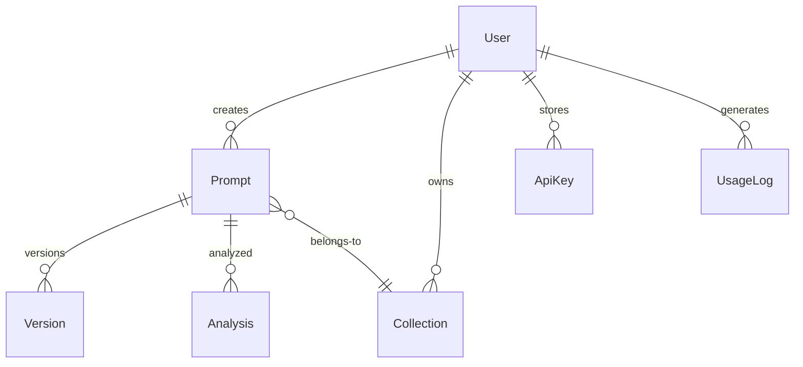

<div align="center">

  <!-- Animated Header Canvas Banner -->
  

  <br>

  <!-- Animated Typing SVG -->
  <a href="https://prompt-plus-7md4ow7pu-unkown3.vercel.app">
    
  </a>

  <br><br>

  <!-- Animated Badges Bar -->
  <p align="center">
    <a href="https://prompt-plus-7md4ow7pu-unkown3.vercel.app">
      
    </a>
    <a href="#-browser-extension">
      
    </a>
    <a href="#-tech-stack--architecture">
      
    </a>
    <a href="https://github.com/OK45batwal/Prompt-plus">
      
    </a>
    <a href="https://github.com/OK45batwal/Prompt-plus/actions">
      
    </a>
  </p>

  <!-- Navigation Menu -->
  <p align="center">
    <a href="#-core-highlights"><strong>Highlights</strong></a> •
    <a href="#-interactive-screenshots"><strong>Screenshots</strong></a> •
    <a href="#-8-step-prompt-compiler"><strong>Compiler Engine</strong></a> •
    <a href="#-browser-extension"><strong>Extension</strong></a> •
    <a href="#-api-reference"><strong>API Specs</strong></a> •
    <a href="#-tech-stack--architecture"><strong>Architecture</strong></a> •
    <a href="#-quickstart--local-setup"><strong>Quickstart</strong></a>
  </p>

</div>

<br>

> ⚡ **Prompt+ is a 100% free AI Prompt Engineering Platform.** Transform raw thoughts into high-performance, structured, role-assigned prompts. Works seamlessly on the web dashboard or inside **ChatGPT, Claude, Gemini, and DeepSeek** via our Manifest V3 Chrome Extension. Features **On-Device AI** (Chrome Gemini Nano — private, offline, zero API key) and **Free Tier API Routing** (OpenRouter Free + NVIDIA Free).

<br>

---

## 🌟 Core Highlights

<div align="center">
  <table>
    <tr>
      <td width="33%" align="center">
        <br>
        
        <h3>8-Step Compiler Engine</h3>
        <p>Intent analysis, missing context gap detection, role assignment, and structural constraint injection.</p>
      </td>
      <td width="33%" align="center">
        <br>
        
        <h3>On-Device Gemini Nano</h3>
        <p>Enhance prompts 100% locally with Chrome's built-in Gemini Nano. Zero latency, private, and offline.</p>
      </td>
      <td width="33%" align="center">
        <br>
        
        <h3>Free Tier Routing</h3>
        <p>OpenRouter Free (Llama 3.3 70B, Gemini 2.0 Flash, DeepSeek R1) & NVIDIA Free API models out-of-the-box.</p>
      </td>
    </tr>
    <tr>
      <td width="33%" align="center">
        <br>
        
        <h3>6-Metric Quality Audit</h3>
        <p>Real-time 100-point scoring across Clarity, Specificity, Structure, Context, Constraints, and Actionability.</p>
      </td>
      <td width="33%" align="center">
        <br>
        
        <h3>Curated Prompt Library</h3>
        <p>24 battle-tested prompt blueprints with 1-click Copy & Toast notifications directly in the Library.</p>
      </td>
      <td width="33%" align="center">
        <br>
        
        <h3>AES-256 Key Vault</h3>
        <p>Optional per-provider API key storage encrypted with AES-256-GCM. Free server models cover you if blank.</p>
      </td>
    </tr>
  </table>
</div>

<br>

---

## 📸 Interactive Screenshots

<div align="center">

  <table>
    <tr>
      <td width="50%">
        
        <p align="center"><strong>🌐 Marketing & Features Landing Page</strong></p>
      </td>
      <td width="50%">
        
        <p align="center"><strong>📊 Dashboard Command Center & Quick Stats</strong></p>
      </td>
    </tr>
  </table>

  <br>

  <table>
    <tr>
      <td width="50%">
        
        <p align="center"><strong>✨ AI Prompt Builder — On-Device / API Toggle</strong></p>
      </td>
      <td width="50%">
        
        <p align="center"><strong>📚 Prompt Library & Curated Blueprints</strong></p>
      </td>
    </tr>
  </table>

  <br>

  <table>
    <tr>
      <td width="50%">
        
        <p align="center"><strong>📁 Custom Prompt Collections & Folders</strong></p>
      </td>
      <td width="50%">
        
        <p align="center"><strong>🧩 Manifest V3 Chrome Extension Overview</strong></p>
      </td>
    </tr>
  </table>

</div>

<br>

---

## 🔄 8-Step Prompt Compiler

Prompt+ executes structural architectural transformations instead of basic rewording:

```mermaid
flowchart LR
    A[Raw Idea] --> B[1. Intent & Domain Analysis]
    B --> C[2. Gap & Context Detection]
    C --> D[3. Meta-Prompt Compilation]
    D --> E[4. LLM Dispatch Engine]
    E --> F[5. Architectural Rewrite]
    F --> G[6. 6-Metric Audit]
    G --> H[7. Version History Index]
    H --> I[8. One-Click Insertion]
```



<details>
<summary><strong>🔍 Click to View Compiler Stage Descriptions</strong></summary>
<br>

| Step | Stage | Description |
| :--- | :--- | :--- |
| **01** | **Input Acquisition** | Captures prompt from web dashboard, keyboard shortcut (`⌘+Shift+K`), or floating action button. |
| **02** | **Intent & Domain Analysis** | Classifies domain (*Software Engineering*, *Data Science*, *Marketing*, *Research*) and complexity tier. |
| **03** | **Context Gap Detection** | Identifies missing role personas, target audience specifications, tone guards, and output format rules. |
| **04** | **Meta-Prompt Compilation** | Builds 8-stage architectural instruction wrappers while preserving core user intent. |
| **05** | **LLM Dispatch Engine** | Routes to Gemini Nano (on-device), OpenRouter Free, or NVIDIA Free API based on key availability. |
| **06** | **Architectural Rewrite** | Restructures prompt into clean sections (*Role*, *Context*, *Instructions*, *Constraints*, *Variables*). |
| **07** | **6-Metric Quality Audit** | Calculates 100-point score across Clarity, Specificity, Structure, Context, Constraints, and Actionability. |
| **08** | **Delivery & Sync** | Instantly inserts into target chatbot textfield or saves snapshot to user Library and Collections. |

</details>

<br>

---

## 🔌 Browser Extension

The **Prompt+ Extension (Manifest V3)** embeds directly into **ChatGPT** (`chatgpt.com`), **Claude** (`claude.ai`), **Gemini** (`gemini.google.com`), and **DeepSeek** (`deepseek.com`).

```
+-------------------------------------------------------------+
|  ✦  Prompt+ Intelligence                     [• Free Server] |
+-------------------------------------------------------------+
|  [ 📱 On-Device ]        [ ⚡ API Based ]                     |
|  On-Device AI — enhanced via Gemini Nano                     |
|  [ Paste or type raw prompt...                            ]  |
|  Token Saver — ~40% fewer tokens in output        [toggle]  |
|  Model: Llama 3.3 70B (OpenRouter Free)                v     |
|  [              ✨ Self-Enhance →                          ]  |
|  API Key (optional)  [ sk-or-... or nvapi-...            ]  |
|  No key? We'll use Prompt+'s free server model.              |
+-------------------------------------------------------------+
|  Context: 1,240 / 128K tokens                [ 1% ]          |
|  Powered by Prompt+                    [Dashboard →]        |
+-------------------------------------------------------------+
```

<details>
<summary><strong>📥 How to Install Chrome Extension</strong></summary>
<br>

1. Open `chrome://extensions` in Chrome, Brave, or Edge.
2. Toggle **Developer mode** on in the top right corner.
3. Click **Load unpacked** and select the `/extension` directory in this repository.
4. Open any AI chatbot website (`chatgpt.com`, `claude.ai`, `gemini.google.com`, or `deepseek.com`).
5. For On-Device mode, use Chrome 138+ with Gemini Nano enabled (`chrome://flags/#prompt-api-for-gemini-nano`).

</details>

<br>

---

## 🏗️ Tech Stack & Architecture



<div align="center">
  <table>
    <tr>
      <td><b>Core Framework</b></td>
      <td>Next.js 16 (App Router, Turbopack), React 19, TypeScript 5, Tailwind CSS v4, Lucide Icons</td>
    </tr>
    <tr>
      <td><b>Auth & Security</b></td>
      <td>NextAuth.js v5, bcrypt (cost 12), AES-256-GCM Key Vault, CSRF Protection, Token Bucket Throttling</td>
    </tr>
    <tr>
      <td><b>Database & ORM</b></td>
      <td>Prisma ORM v7, PostgreSQL (Neon Serverless HTTP / Prisma Postgres)</td>
    </tr>
    <tr>
      <td><b>AI Model Dispatch</b></td>
      <td>Chrome Gemini Nano (On-Device), OpenRouter Free Models, NVIDIA NIM API, OpenAI, Anthropic</td>
    </tr>
    <tr>
      <td><b>Testing & CI</b></td>
      <td>Vitest v4, Vercel Serverless, GitHub Actions Automated Gate Pipeline</td>
    </tr>
  </table>
</div>

<br>

---

## 🛠️ API Reference

<details>
<summary><strong>📡 Click to Expand Complete REST API Specification</strong></summary>
<br>

### V1 Endpoints (Authenticated)

| Method | Endpoint | Description |
| :--- | :--- | :--- |
| `GET` | `/api/v1/prompts` | List prompts (pagination, search, filter) |
| `POST` | `/api/v1/prompts` | Create a new prompt |
| `GET` | `/api/v1/prompts/[id]` | Get single prompt |
| `PUT` | `/api/v1/prompts/[id]` | Update prompt |
| `DELETE` | `/api/v1/prompts/[id]` | Delete prompt |
| `GET` | `/api/v1/prompts/[id]/versions` | List version history |
| `POST` | `/api/v1/prompts/enhance-ai` | **Core** — Enhance prompt via LLM |
| `POST` | `/api/v1/prompts/analyze` | Analyze prompt intent & complexity |
| `POST` | `/api/v1/prompts/score` | Score prompt quality |
| `POST` | `/api/v1/prompts/share` | Generate share token |
| `GET/POST` | `/api/v1/collections` | List / create collections |
| `GET/PUT/DELETE` | `/api/v1/collections/[id]` | Single collection CRUD |
| `GET/POST` | `/api/v1/templates` | List / create templates |
| `POST` | `/api/v1/extension/enhance` | Extension enhancement endpoint |

</details>

<br>

---

## 🚀 Quickstart & Local Setup

```bash
# 1. Clone repository
git clone https://github.com/OK45batwal/Prompt-plus.git
cd Prompt-plus

# 2. Install dependencies
npm install

# 3. Environment configuration
cp .env.example .env.local
# Configure AUTH_SECRET & DATABASE_URL

# 4. Initialize Database schema
npx prisma db push

# 5. Run development server
npm run dev
```

Open [http://localhost:3000](http://localhost:3000) in your browser.

```bash
# Run tests, build check & linter
npm test
npm run build
npm run lint
```

<br>

---

## 📄 License & Terms

Copyright &copy; 2026 **Prompt+**. All rights reserved. Proprietary software.

<br>

<div align="center">

  

  <sub>Designed & developed with ❤️ by <a href="https://github.com/OK45batwal">OK45batwal</a></sub>
  <br><br>
  <a href="https://prompt-plus-7md4ow7pu-unkown3.vercel.app"><strong>🌐 Visit Production App →</strong></a>

</div>
