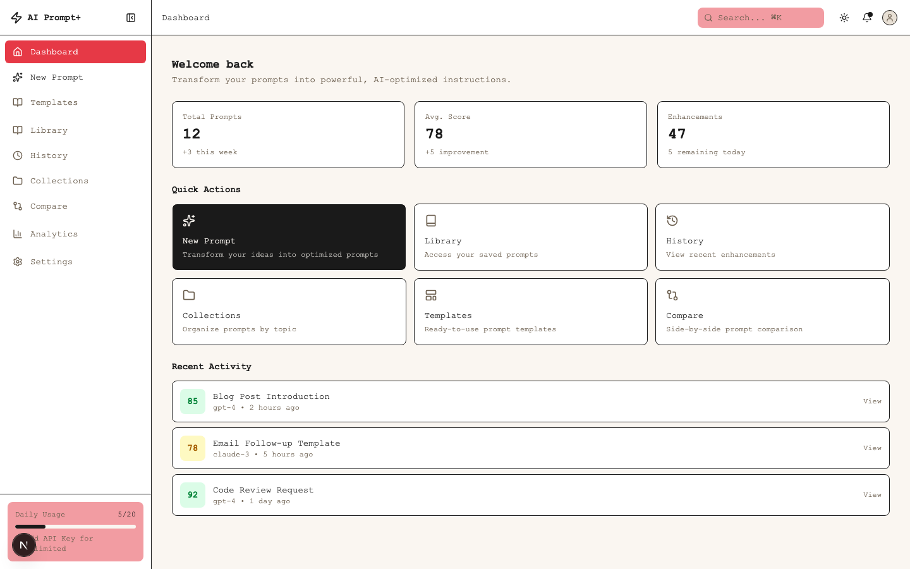
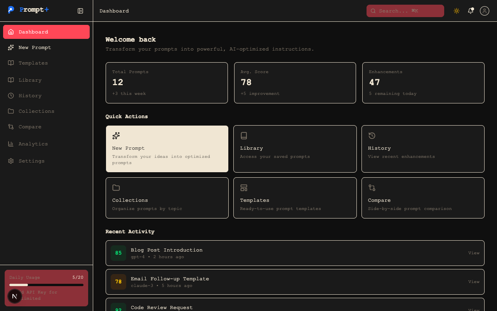
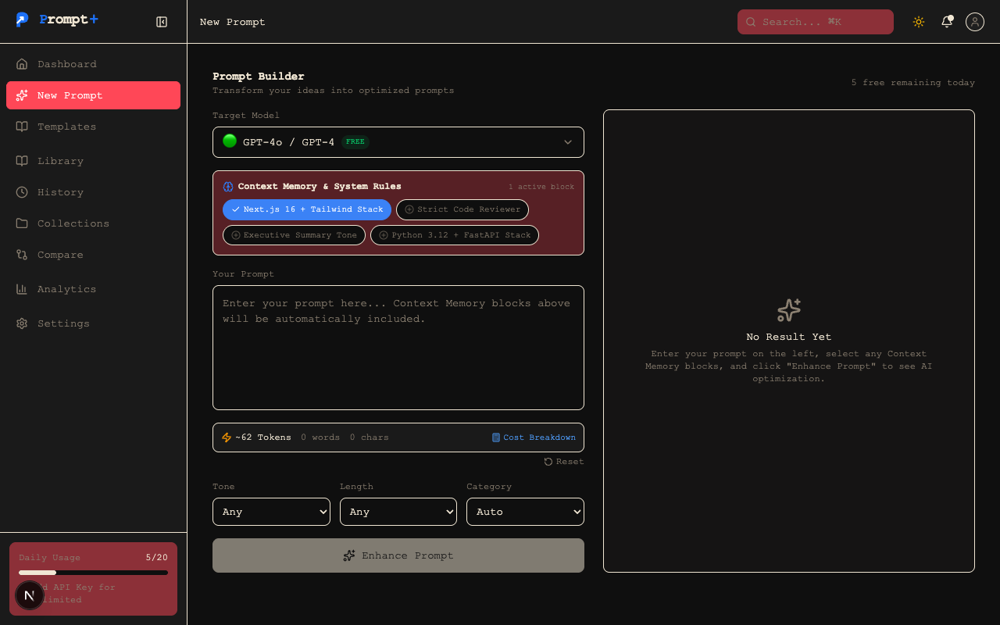
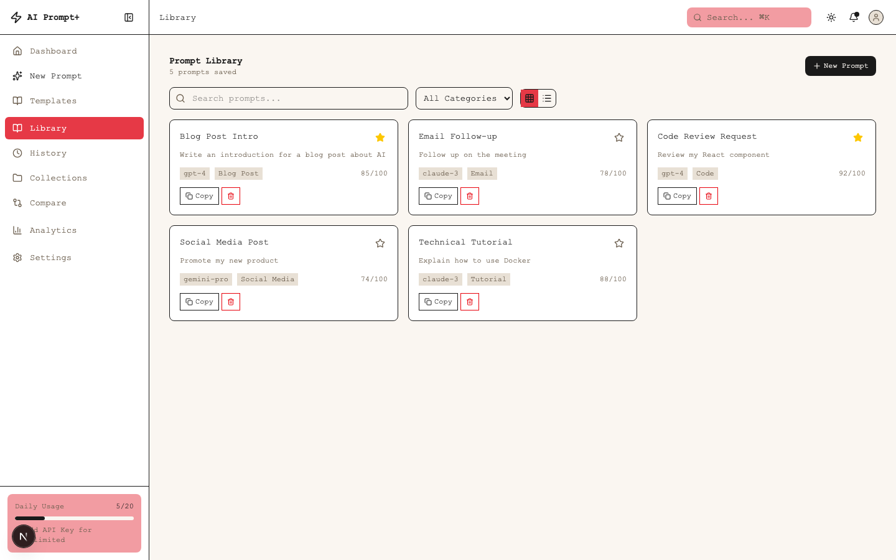
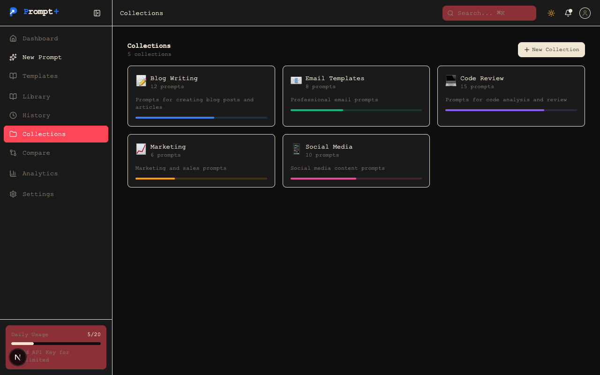
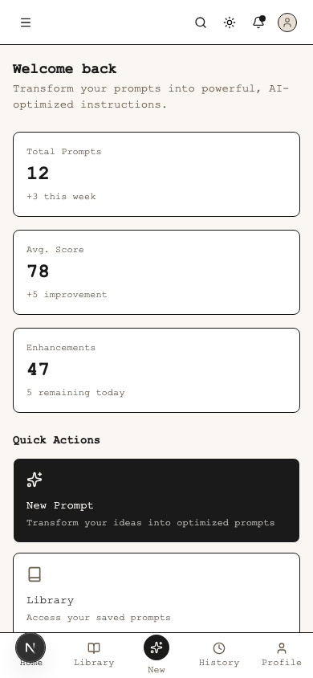

<p align="center">
  
</p>

<p align="center">
  <h1 align="center">⚡ AI Prompt+</h1>
  <p align="center">Transform simple prompts into powerful, AI-optimized instructions</p>
</p>

<!-- GitHub Badges -->
<p align="center">
  <a href="https://github.com/OK45batwal/Prompt-plus/actions/workflows/ci.yml">
    
  </a>
  <a href="LICENSE">
    
  </a>
  
  
  
  
</p>

<p align="center">
  <a href="#features">Features</a> •
  <a href="#tech-stack">Tech Stack</a> •
  <a href="#getting-started">Getting Started</a> •
  <a href="#screenshots">Screenshots</a>
</p>

---

## ✨ Features

| Feature | Description |
|---------|-------------|
| **AI Enhancement** | Real multi-provider LLM prompts optimization (OpenAI / Anthropic) |
| **Prompt Scoring** | Real LLM dimension scoring across 6 key metrics |
| **Token Diffing** | Token-level visual diff comparing additions & removals |
| **Library** | Save, search, and manage your prompt collection |
| **Collections** | Organize prompts by topic into curated collections |
| **Template Marketplace** | Public templates with official badge filter & usage tracking |
| **Sharing** | Generate public shareable read-only prompt links |
| **Analytics & Usage** | Real usage tracking, daily rate limiting, and event logging |
| **Encrypted API Keys** | AES-256-GCM encrypted user API key storage |
| **Dark Mode** | Seamless light/dark theme toggle |

## 🖼️ Screenshots

| Light Mode | Dark Mode |
|:---:|:---:|
|  |  |
| **New Prompt** | **Library** |
|  |  |
| **Collections** | **Mobile View** |
|  |  |

## 🛠️ Tech Stack

| Layer | Technology |
|-------|-----------|
| **Framework** | [Next.js 16](https://nextjs.org) (Turbopack) |
| **Auth** | NextAuth.js v5 (JWT + Bcrypt) |
| **Language** | TypeScript |
| **UI** | Tailwind CSS v4 + Base UI |
| **Database** | SQLite + Prisma ORM 7 |
| **Testing** | Vitest Test Runner |
| **CI/CD** | GitHub Actions Workflow |

## 🚀 Getting Started

```bash
git clone https://github.com/OK45batwal/Prompt-plus.git
cd ai-prompt-plus
npm install
npx prisma db push
npm run dev
```

Open [http://localhost:3000](http://localhost:3000) to see the app.

### Run Tests

```bash
npm test
```

## 📄 License

[MIT](LICENSE)

---

<p align="center">
  Built with <a href="https://nextjs.org">Next.js</a>
</p>
