<div align="center">

  

  <h1>Prompt+</h1>
  <p>
    <strong>Enterprise-grade AI prompt engineering & compilation.</strong> Rewrite rough ideas into role-conditioned, constraint-rich
    instructions built for <strong>ChatGPT · Claude · Gemini · DeepSeek</strong> — with sub-30ms <strong>Loop Engineering</strong>,
    a cross-AI <strong>Context Memory Bridge</strong>, a private <strong>On-Device Gemini Nano</strong> mode, and a native browser extension.
  </p>

  <br>

  <p>
    <a href="https://prompt-plus-three.vercel.app/">
      
    </a>
    <a href="https://chromewebstore.google.com/detail/gdfaohfmmjjmpiggdcankjjihpljoccn">
      
    </a>
    <a href="https://github.com/OK45batwal/Prompt-plus">
      
    </a>
    <a href="https://github.com/OK45batwal/Prompt-plus/actions">
      
    </a>
    <a href="LICENSE">
      
    </a>
  </p>

  <!-- Nav -->
  <p>
    <a href="#features"><strong>Features</strong></a> ·
    <a href="#visual-tour"><strong>Visual Tour</strong></a> ·
    <a href="#loop-engine"><strong>Loop Engine</strong></a> ·
    <a href="#browser-extension"><strong>Extension v1.3.2</strong></a> ·
    <a href="#tech-stack"><strong>Tech Stack</strong></a> ·
    <a href="#api-reference"><strong>API Reference</strong></a> ·
    <a href="#quickstart"><strong>Quickstart</strong></a>
  </p>

</div>

---

## Features

<div align="center">

<table width="100%">
  <tr>
    <td width="33%" valign="top">
      <p align="center"><strong>⚡ Sub-30ms Loop Engine</strong></p>
      <p align="center" style="font-size:13px;color:#94a3b8">Autonomous closed-loop refinement (<em>Generate → Evaluate → Auto-Repair → Polish</em>) with AutoCorrect typo normalization and Zero-Fluff Sanitizer.</p>
    </td>
    <td width="33%" valign="top">
      <p align="center"><strong>📦 Cross-AI Context Bridge</strong></p>
      <p align="center" style="font-size:13px;color:#94a3b8">1-click memory capture to seamlessly hand off active chat context between ChatGPT, Claude 3.5 Sonnet, Gemini 2.0, and DeepSeek.</p>
    </td>
    <td width="34%" valign="top">
      <p align="center"><strong>📱 On-Device Gemini Nano</strong></p>
      <p align="center" style="font-size:13px;color:#94a3b8">Runs 100% locally in Chrome via the Prompt API. Fully private, zero latency, offline, and no API keys required.</p>
    </td>
  </tr>
  <tr>
    <td valign="top">
      <p align="center"><strong>📊 Real-Time Analytics Hub</strong></p>
      <p align="center" style="font-size:13px;color:#94a3b8">Optimization velocity wave chart, AI model distribution breakdown, latency telemetry, and live execution audit stream.</p>
    </td>
    <td valign="top">
      <p align="center"><strong>🔔 In-App Notification Center</strong></p>
      <p align="center" style="font-size:13px;color:#94a3b8">Real-time alert notifications with unread badges, category filtering (System, Optimization, Security), and 1-click dismiss actions.</p>
    </td>
    <td valign="top">
      <p align="center"><strong>🔐 AES-256 Cloud Key Vault</strong></p>
      <p align="center" style="font-size:13px;color:#94a3b8">Encrypted server persistence for OpenAI, Anthropic, Google, and OpenRouter keys with live syntax & connectivity validation.</p>
    </td>
  </tr>
</table>
</div>

---

## Visual Tour

<div align="center">
  <table>
    <tr>
      <td width="50%">
        
        <p align="center"><sub><strong>Landing page & hero</strong></sub></p>
      </td>
      <td width="50%">
        
        <p align="center"><sub><strong>Dashboard command center & quick stats</strong></sub></p>
      </td>
    </tr>
    <tr>
      <td width="50%">
        
        <p align="center"><sub><strong>AI Studio with Voice Dictation & Context Memory</strong></sub></p>
      </td>
      <td width="50%">
        
        <p align="center"><sub><strong>Saved prompts & curated blueprints</strong></sub></p>
      </td>
    </tr>
    <tr>
      <td width="50%">
        
        <p align="center"><sub><strong>Custom prompt collections</strong></sub></p>
      </td>
      <td width="50%">
        
        <p align="center"><sub><strong>Developer persona, avatar presets & engine controls</strong></sub></p>
      </td>
    </tr>
  </table>
</div>

---

## Loop Engine

The Prompt+ compilation pipeline runs a multi-cycle convergence optimizer guaranteeing **<30ms execution** with structural validation.

```mermaid
flowchart LR
    A[Raw Input] -->|Typo Normalizer| B[1. AutoCorrect]
    B -->|Intent Extraction| C[2. PromptIR Synthesis]
    C -->|Domain Routing| D[3. Multi-Engine Compiler]
    D -->|Rubric Evaluator| E[4. Quality Audit 0-100]
    E -->|Critique & Repair| F[5. Auto-Repair Loop]
    F -->|Zero-Fluff Stripper| G[6. Production Polish]
    G -->|Context Handoff| H[7. One-Click Insertion]
```



<details>
<summary><strong>Expand the per-stage breakdown</strong></summary>

| Step | Stage | Functional workflow |
| :--- | :--- | :--- |
| **01** | **AutoCorrect Normalizer** | Corrects 150+ developer typos (*imrpove → improve, scrpaer → scraper*) prior to compilation. |
| **02** | **PromptIR Synthesis** | Extracts goals, domain constraints, role personas, and target model schemas. |
| **03** | **Multi-Engine Compiler** | Dispatches to Free Server AI, Gemini Nano (On-Device), or dedicated user API keys. |
| **04** | **Quality Scoring Audit** | Evaluates Clarity, Specificity, Structure, Context, Constraints, and Actionability. |
| **05** | **Auto-Repair Convergence** | Executes closed-loop refinement until quality index reaches $\ge 85\text{ pts}$. |
| **06** | **Zero-Fluff Sanitizer** | Strips preamble filler, Prompt IDs, and conversational meta-artifacts. |
| **07** | **Context Memory Sync** | Bundles active memory blocks for 1-click execution across target web chatbots. |

</details>

---

## Browser Extension

The **Manifest V3 extension (v1.3.2)** is live on the **Chrome Web Store**! It drops straight into **ChatGPT**, **Claude AI**, **Gemini**, **DeepSeek**, and **Grok**.

👉 **[Install from Official Chrome Web Store](https://chromewebstore.google.com/detail/gdfaohfmmjjmpiggdcankjjihpljoccn)**

```
┌──────────────────────────────────────────────────┐
│  ✦  Prompt+ Intelligence v1.3.2    [ • SECURE ]   │
│                                                  │
│  ( On-Device )   ( No-API Engine )  ( Cloud AI ) │
│  ⚡ Sub-30ms Loop Engine Active                   │
│                                                  │
│  [ Paste or type your prompt to enhance...   ]   │
│  [              ✦  Enhance Prompt           ]    │
│                                                  │
│  📦 Capture Memory › Multi-Model Context Bridge  │
│  Context: 1,240 / 128K tokens           [ 1% ]   │
│  Prompt+ Intelligence            [ Dashboard ]   │
└──────────────────────────────────────────────────┘
```

### ⌨️ Extension Keyboard Shortcuts

| Shortcut | OS | Action |
| :--- | :--- | :--- |
| **`Cmd + Shift + P`** | macOS | Open / toggle Prompt+ floating architect panel on active chat input |
| **`Ctrl + Shift + P`** | Windows / Linux | Open / toggle Prompt+ floating architect panel on active chat input |

<details>
<summary><strong>📥 Manual & Local Developer Installation</strong></summary>

1. Official Listing: [Chrome Web Store — Prompt+ Architect AI](https://chromewebstore.google.com/detail/gdfaohfmmjjmpiggdcankjjihpljoccn).
2. For manual developer testing: Open `chrome://extensions` $\rightarrow$ Enable **Developer mode**.
3. Click **Load unpacked** and select the [`/extension`](./extension) folder.
4. Visit any supported web chatbot: `chatgpt.com`, `claude.ai`, `gemini.google.com`, or `deepseek.com`.
5. Package build script: `npm run build:extension` $\rightarrow$ produces `dist/prompt-plus-extension-v1.3.2.zip`.

</details>

---

## Tech Stack

| Layer | Technologies |
| :--- | :--- |
| **Framework** | Next.js 16 (App Router, Turbopack), React 19, TypeScript 5, Tailwind CSS v4, Lucide icons |
| **Security & Auth** | NextAuth.js v5, bcrypt (cost 12), AES-256-GCM cloud key vault, CSRF protection, rate limiting |
| **Database & ORM** | Prisma ORM v7, PostgreSQL (Neon Serverless / Prisma Postgres) |
| **AI Model Routing** | Chrome Gemini Nano, OpenRouter Free, NVIDIA NIM, OpenAI, Anthropic |
| **Testing & CI** | Vitest v4 (89+ tests), Playwright E2E, GitHub Actions CI pipeline |
| **Platform** | Vercel Serverless, `@vercel/analytics`, `@vercel/speed-insights` |

---

## API Reference

Authenticated **`/api/v1`** REST endpoints strictly guarded with CSRF protection and schema validation.

<details>
<summary><strong>📡 Expand full endpoint table</strong></summary>

| Method | Endpoint | Description |
| :--- | :--- | :--- |
| `GET` | `/api/v1/prompts` | List prompts (pagination, search, filter) |
| `POST` | `/api/v1/prompts` | Create a prompt |
| `GET/PUT/DELETE` | `/api/v1/prompts/[id]` | Single prompt CRUD |
| `GET/POST` | `/api/v1/prompts/[id]/versions` | List / create prompt version history |
| `POST` | `/api/v1/prompts/enhance-ai` | **Core** — enhance a prompt via Loop Engine |
| `POST` | `/api/v1/prompts/analyze` | Analyze prompt intent, context gaps & complexity |
| `POST` | `/api/v1/prompts/score` | Score prompt quality across 6 rubrics |
| `POST` | `/api/v1/prompts/share` | Generate or revoke prompt share token |
| `GET/POST` | `/api/v1/collections` | List / create prompt collections |
| `GET/PUT/DELETE` | `/api/v1/collections/[id]` | Single-collection CRUD |
| `GET/POST` | `/api/v1/templates` | List / create blueprint templates |
| `GET/PATCH/DELETE`| `/api/v1/notifications` | In-app notification center (feed, mark read, dismiss) |
| `GET/PATCH` | `/api/v1/user/preferences` | Persist developer personas, AI defaults & alerts |
| `GET/POST/DELETE` | `/api/v1/api-keys` | AES-256 encrypted personal API keys vault |
| `POST` | `/api/v1/api-keys/test` | Live syntax and connectivity validator |
| `GET` | `/api/v1/analytics/stats` | Real-time velocity, latency & model telemetry |
| `POST` | `/api/v1/extension/enhance` | Chrome extension compiled enhancement endpoint |

</details>

---

## Quickstart

```bash
# 1. Clone the repository
git clone https://github.com/OK45batwal/Prompt-plus.git
cd Prompt-plus

# 2. Install dependencies
npm install

# 3. Configure environment
cp .env.example .env.local

# 4. Initialize the database schema
npx prisma db push

# 5. Start the development server
npm run dev
```

Then open `http://localhost:3000` (web) or install the extension from `chrome://extensions`.

---

## Featured Scripts

| Command | Purpose |
| :--- | :--- |
| `npm run dev` | Start the Next.js Turbopack dev server |
| `npm run build` | Production bundle build + extension packaging |
| `npm run lint` | ESLint zero-warning check over the codebase |
| `npm test` | Run API route security gate + Vitest suite (89/89 passing) |
| `npm run test:e2e` | Run Playwright end-to-end browser tests |
| `npm run build:extension` | Package the Chrome extension (`v1.3.2.zip`) |
| `npm run check-env` | Validate required environment variables |

---

<div align="center">

**License** — Copyright © 2026 **Prompt+**. All rights reserved. See [`LICENSE`](./LICENSE).

[**🌐 Visit the production app**](https://prompt-plus-three.vercel.app/) · [**View repository**](https://github.com/OK45batwal/Prompt-plus) · [**Author: OK45batwal**](https://github.com/OK45batwal)

<br>


</div>