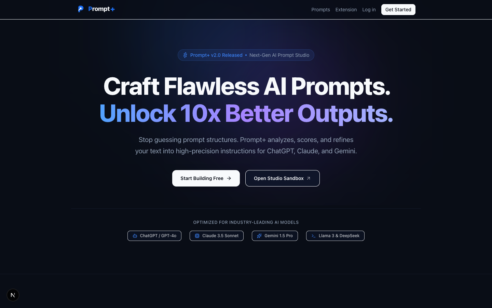
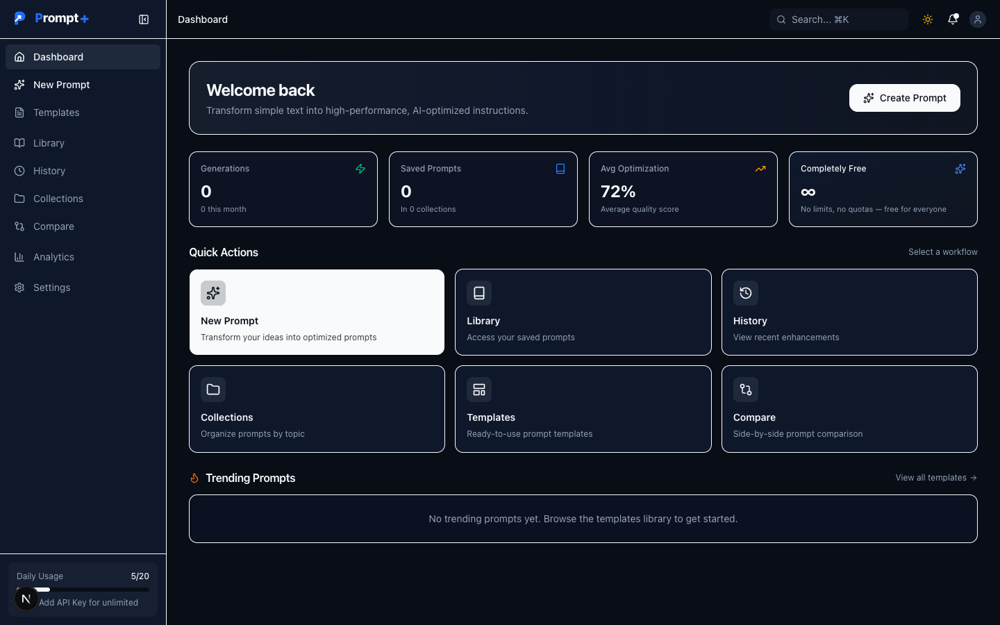
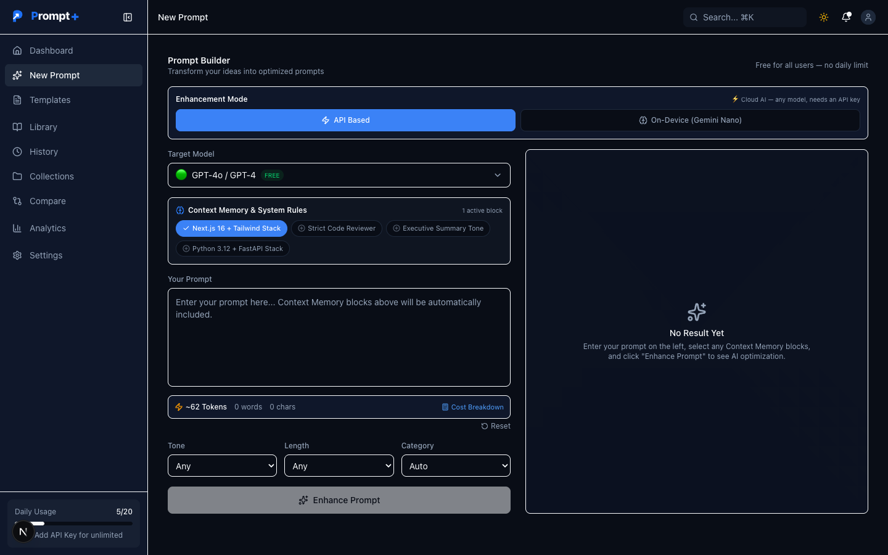
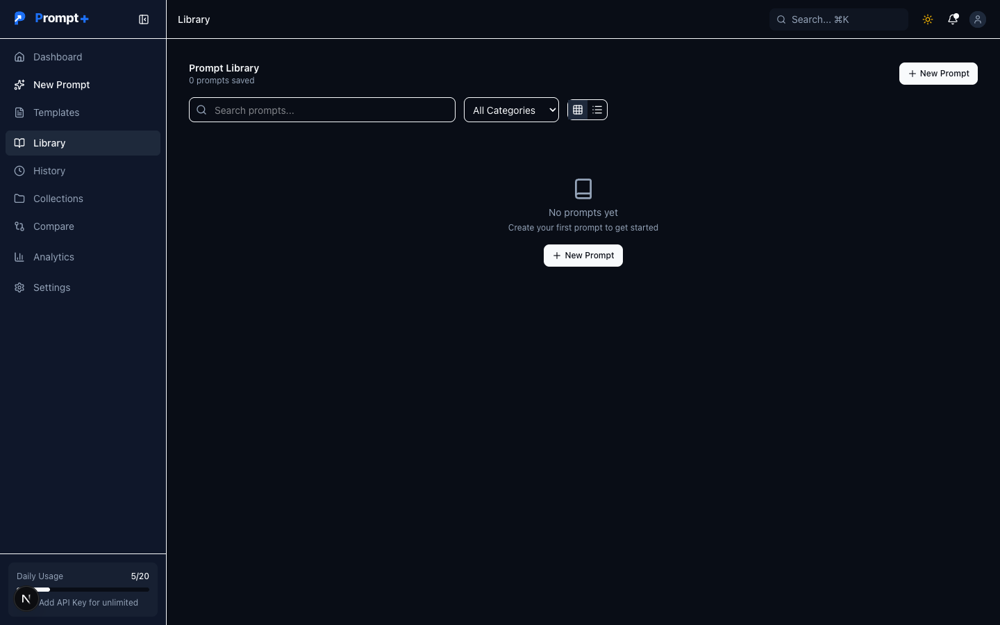
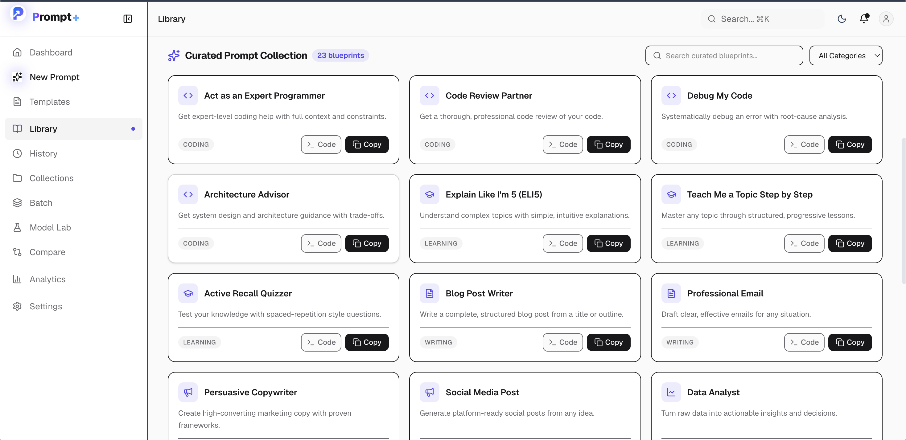
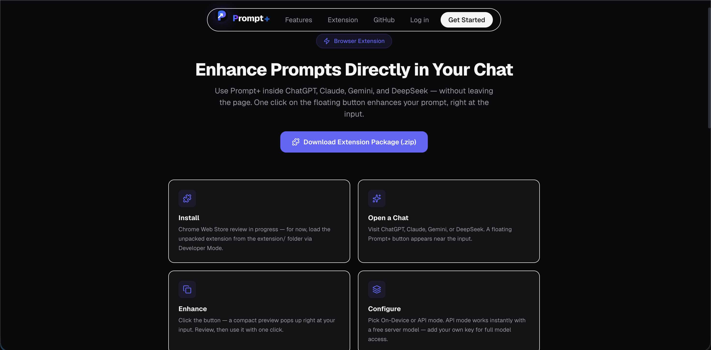

<div align="center">

  <!-- Crisp Cyberpunk Header Banner — Zero Text Clipping -->
  

  <br>

  <!-- Animated Typing SVG — Perfectly Scaled -->
  <a href="https://prompt-plus-three.vercel.app/">
    
  </a>

  <br><br>

  <!-- Sleek Glowing Shields Bar -->
  <p align="center">
    <a href="https://prompt-plus-three.vercel.app/">
      
    </a>
    <a href="#-browser-extension">
      
    </a>
    <a href="#-tech-stack">
      
    </a>
    <a href="https://github.com/OK45batwal/Prompt-plus">
      
    </a>
    <a href="https://github.com/OK45batwal/Prompt-plus/actions">
      
    </a>
  </p>

  <!-- Quick Nav Pills -->
  <p align="center">
    <a href="#-why-prompt"><strong>Why Prompt+</strong></a> •
    <a href="#-visual-tour"><strong>Visual Tour</strong></a> •
    <a href="#-8-step-compiler"><strong>Compiler</strong></a> •
    <a href="#-browser-extension"><strong>Extension</strong></a> •
    <a href="#-api-specifications"><strong>API Specs</strong></a> •
    <a href="#-tech-stack"><strong>Tech Stack</strong></a> •
    <a href="#-quickstart"><strong>Quickstart</strong></a>
  </p>

</div>

<br>

<div align="center">
  <table width="100%">
    <tr>
      <td style="background: linear-gradient(135deg, rgba(59, 130, 246, 0.1), rgba(139, 92, 246, 0.1)); border: 1px solid rgba(99, 102, 241, 0.3); border-radius: 12px; padding: 14px 18px;">
        <p align="center" style="margin: 0; font-size: 13px; color: #94a3b8; line-height: 1.6;">
          ⚡ <strong>Prompt+</strong> is an enterprise-grade AI prompt engineering platform and Chrome extension. It rewrites simple ideas into role-conditioned, constraint-rich instructions optimized for <strong>ChatGPT, Claude, Gemini, and DeepSeek</strong>. Features <strong>On-Device Gemini Nano AI</strong> for offline processing with zero latency.
        </p>
      </td>
    </tr>
  </table>
</div>

<br>

---

## ⚡ Why Prompt+?

<div align="center">

  <table width="100%">
    <tr>
      <td width="50%" valign="top" style="border-top: 3px solid #3b82f6; background: #0f172a; padding: 14px; border-radius: 8px;">
        <div align="center">
          
          <h4 style="color: #60a5fa; margin: 6px 0;">8-Step Compiler</h4>
        </div>
        <p style="font-size: 12px; color: #cbd5e1; line-height: 1.5; margin: 0;">
          Intent analysis, context gap detection, role conditioning, and boundary constraints. Prompts are structurally compiled, not just reworded.
        </p>
      </td>
      <td width="50%" valign="top" style="border-top: 3px solid #8b5cf6; background: #0f172a; padding: 14px; border-radius: 8px;">
        <div align="center">
          
          <h4 style="color: #c084fc; margin: 6px 0;">On-Device Gemini Nano</h4>
        </div>
        <p style="font-size: 12px; color: #cbd5e1; line-height: 1.5; margin: 0;">
          Runs 100% locally inside Chrome 138+ (Prompt API). Completely private, zero cost, works offline, and requires no API key.
        </p>
      </td>
    </tr>
    <tr>
      <td width="50%" valign="top" style="border-top: 3px solid #10b981; background: #0f172a; padding: 14px; border-radius: 8px;">
        <div align="center">
          
          <h4 style="color: #34d399; margin: 6px 0;">Free Tier AI Routing</h4>
        </div>
        <p style="font-size: 12px; color: #cbd5e1; line-height: 1.5; margin: 0;">
          Out-of-the-box routing to OpenRouter Free (Llama 3.3 70B, Gemini 2.0 Flash, DeepSeek R1) & NVIDIA Free API models.
        </p>
      </td>
      <td width="50%" valign="top" style="border-top: 3px solid #f59e0b; background: #0f172a; padding: 14px; border-radius: 8px;">
        <div align="center">
          
          <h4 style="color: #fbbf24; margin: 6px 0;">6-Metric Quality Audit</h4>
        </div>
        <p style="font-size: 12px; color: #cbd5e1; line-height: 1.5; margin: 0;">
          Evaluates Clarity, Specificity, Structure, Context, Constraints, and Actionability with a 100-point quality score index.
        </p>
      </td>
    </tr>
    <tr>
      <td width="50%" valign="top" style="border-top: 3px solid #ec4899; background: #0f172a; padding: 14px; border-radius: 8px;">
        <div align="center">
          
          <h4 style="color: #f472b6; margin: 6px 0;">Curated Library</h4>
        </div>
        <p style="font-size: 12px; color: #cbd5e1; line-height: 1.5; margin: 0;">
          24 hand-crafted prompt blueprints with 1-click Copy & Toast notifications directly inside the Prompt Library.
        </p>
      </td>
      <td width="50%" valign="top" style="border-top: 3px solid #06b6d4; background: #0f172a; padding: 14px; border-radius: 8px;">
        <div align="center">
          
          <h4 style="color: #22d3ee; margin: 6px 0;">AES-256 Key Vault</h4>
        </div>
        <p style="font-size: 12px; color: #cbd5e1; line-height: 1.5; margin: 0;">
          Per-provider API key vault encrypted with AES-256-GCM. Bringing your own key is optional — free server models cover you.
        </p>
      </td>
    </tr>
  </table>

</div>

<br>

---

## 🎨 Visual Tour

<div align="center">

  <table>
    <tr>
      <td width="50%">
        
        <p align="center"><sub><strong>🌐 Landing Page & Hero Section</strong></sub></p>
      </td>
      <td width="50%">
        
        <p align="center"><sub><strong>📊 Dashboard Command Center & Quick Stats</strong></sub></p>
      </td>
    </tr>
    <tr>
      <td width="50%">
        
        <p align="center"><sub><strong>✨ AI Prompt Builder (On-Device / API Modes)</strong></sub></p>
      </td>
      <td width="50%">
        
        <p align="center"><sub><strong>📚 Saved Prompts & Curated Blueprints</strong></sub></p>
      </td>
    </tr>
    <tr>
      <td width="50%">
        
        <p align="center"><sub><strong>📁 Custom Prompt Collections</strong></sub></p>
      </td>
      <td width="50%">
        
        <p align="center"><sub><strong>🧩 Manifest V3 Chrome Extension Overview</strong></sub></p>
      </td>
    </tr>
  </table>

</div>

<br>

---

## 🔄 8-Step Compiler


<details>
<summary><strong>🔍 Expand Detailed Compiler Stage Breakdown</strong></summary>
<br>

| Step | Stage | Functional Workflow |
| :--- | :--- | :--- |
| **01** | **Input Acquisition** | Captures raw prompt via web UI, keyboard shortcut (`⌘+Shift+K`), or floating action button. |
| **02** | **Intent Analysis** | Classifies domain (*Engineering*, *Data*, *Marketing*, *Writing*) and determines complexity. |
| **03** | **Context Gap Detection** | Identifies missing role personas, output guidelines, constraints, and format guards. |
| **04** | **Meta-Prompt Compilation** | Builds 8-stage architectural instruction wrappers while preserving core user intent. |
| **05** | **LLM Dispatch Engine** | Selects Gemini Nano (On-Device), OpenRouter Free, or NVIDIA Free API based on key availability. |
| **06** | **Architectural Rewrite** | Restructures input into clean sections: *Role*, *Context*, *Instructions*, *Constraints*, *Variables*. |
| **07** | **Quality Audit** | Evaluates Clarity, Specificity, Structure, Context, Constraints, and Actionability (0-100 score). |
| **08** | **Delivery & Sync** | Inserts transformed prompt into target chatbot textfield or saves snapshot to user Library. |

</details>

<br>

---

## 🔌 Browser Extension

The **Prompt+ Browser Extension (Manifest V3)** integrates natively into **ChatGPT** (`chatgpt.com`), **Claude** (`claude.ai`), **Gemini** (`gemini.google.com`), and **DeepSeek** (`deepseek.com`).

<div align="center">

```
┌───────────────────────────────────────────────────┐
│  ✦  Prompt+ Intelligence          [• Free Server] │
├───────────────────────────────────────────────────┤
│  [ 📱 On-Device ]        [ ⚡ API Based ]          │
│  On-Device AI — enhanced via Gemini Nano          │
│                                                   │
│  [ Paste or type raw prompt idea...           ]   │
│                                                   │
│  Token Saver — ~40% fewer tokens in output        │
│  Model: Llama 3.3 70B (OpenRouter Free)   v       │
│                                                   │
│  [          ✨ Self-Enhance Prompt →          ]   │
│                                                   │
│  API Key (optional)  [ sk-or-... or nvapi-... ]   │
├───────────────────────────────────────────────────┤
│  Context: 1,240 / 128K tokens              [ 1% ] │
│  Powered by Prompt+                 [Dashboard →] │
└───────────────────────────────────────────────────┘
```

</div>

<details>
<summary><strong>📥 Click to View Extension Installation Instructions</strong></summary>
<br>

1. Open `chrome://extensions` in Chrome, Brave, or Edge.
2. Toggle **Developer mode** on in the top right corner.
3. Click **Load unpacked** and select the `/extension` directory in this repository.
4. Open any AI chatbot website (`chatgpt.com`, `claude.ai`, `gemini.google.com`, or `deepseek.com`).
5. For On-Device mode, use Chrome 138+ with Gemini Nano enabled (`chrome://flags/#prompt-api-for-gemini-nano`).

</details>

<br>

---

## 💻 Quickstart

<div align="center">
  <table width="100%">
    <tr>
      <td style="background: #090d16; border: 1px solid #1e293b; border-radius: 8px; padding: 10px 16px;">
        <span style="color: #ef4444;">●</span> <span style="color: #eab308;">●</span> <span style="color: #22c55e;">●</span> &nbsp; <strong style="color: #94a3b8; font-family: monospace;">bash — terminal</strong>
      </td>
    </tr>
    <tr>
      <td style="background: #0f172a; padding: 14px 16px;">

```bash
# 1. Clone repository
git clone https://github.com/OK45batwal/Prompt-plus.git
cd Prompt-plus

# 2. Install dependencies
npm install

# 3. Configure environment
cp .env.example .env.local

# 4. Initialize Database schema
npx prisma db push

# 5. Launch development server
npm run dev
```

      </td>
    </tr>
  </table>
</div>

<br>

---

## 🏗️ Tech Stack

<div align="center">
  <table width="100%">
    <tr>
      <td width="22%"><b>Core Framework</b></td>
      <td>Next.js 16 (App Router, Turbopack), React 19, TypeScript 5, Tailwind CSS v4, Lucide Icons</td>
    </tr>
    <tr>
      <td width="22%"><b>Security & Auth</b></td>
      <td>NextAuth.js v5, bcrypt (cost 12), AES-256-GCM Key Vault, CSRF Protection, Rate Limiting</td>
    </tr>
    <tr>
      <td width="22%"><b>Database & ORM</b></td>
      <td>Prisma ORM v7, PostgreSQL (Neon Serverless / Prisma Postgres)</td>
    </tr>
    <tr>
      <td width="22%"><b>AI Model Routing</b></td>
      <td>Chrome Gemini Nano (On-Device), OpenRouter Free Models, NVIDIA NIM API, OpenAI, Anthropic</td>
    </tr>
    <tr>
      <td width="22%"><b>Testing & CI</b></td>
      <td>Vitest v4, Vercel Serverless, GitHub Actions Automated Gate Pipeline</td>
    </tr>
  </table>
</div>

<br>

---

## 🛠️ API Specifications

<details>
<summary><strong>📡 Expand Full REST API Reference Table</strong></summary>
<br>

### V1 Endpoints (Authenticated)

| Method | Endpoint | Description |
| :--- | :--- | :--- |
| `GET` | `/api/v1/prompts` | List prompts (pagination, search, filter) |
| `POST` | `/api/v1/prompts` | Create a new prompt |
| `GET` | `/api/v1/prompts/[id]` | Get single prompt |
| `PUT` | `/api/v1/prompts/[id]` | Update prompt |
| `DELETE` | `/api/v1/prompts/[id]` | Delete prompt |
| `GET` | `/api/v1/prompts/[id]/versions` | List version history |
| `POST` | `/api/v1/prompts/enhance-ai` | **Core** — Enhance prompt via LLM |
| `POST` | `/api/v1/prompts/analyze` | Analyze prompt intent & complexity |
| `POST` | `/api/v1/prompts/score` | Score prompt quality |
| `POST` | `/api/v1/prompts/share` | Generate share token |
| `GET/POST` | `/api/v1/collections` | List / create collections |
| `GET/PUT/DELETE` | `/api/v1/collections/[id]` | Single collection CRUD |
| `GET/POST` | `/api/v1/templates` | List / create templates |
| `POST` | `/api/v1/extension/enhance` | Extension enhancement endpoint |

</details>

<br>

---

## 📄 License & Terms

Copyright &copy; 2026 **Prompt+**. All rights reserved. Proprietary software.

<br>

<div align="center">

  

  <sub>Designed & developed with ❤️ by <a href="https://github.com/OK45batwal">OK45batwal</a></sub>
  <br><br>
  <a href="https://prompt-plus-7md4ow7pu-unkown3.vercel.app"><strong>🌐 Visit Production App →</strong></a>

</div>
